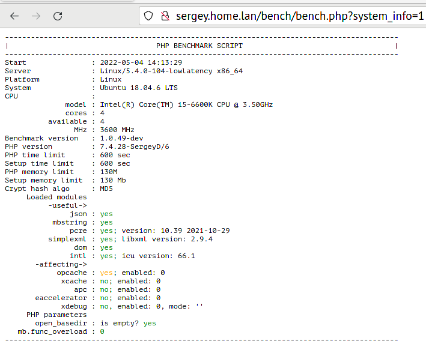

# Простой скрипт проверки быстродействия PHP

Работает со всеми версиями ПХП: от 4.3 до 8.4

## Зависимости

Необходимые модули для полного тестирования php:

- pcre
- mbstring
- json
- dom
- simplexml
- intl
- optional:
  - gd
  - imagick
  - brotli
  - zlib
  - bz2
  - zstd
  - lz4
  - snappy
  - igbinary
  - msgpack
  - uuid
  - memcache
  - redis
  - sqlite3
  - mysql/mysqli
  - pgsql

Обычно они уже установлены или "вкомпилированны" в php.

Проверить наличие:

- в консоли `php -m`
- или через вывод функции `phpinfo()`

### Модули, влияющие на результаты тестов

- xdebug - может замедлить работу большей части тестов в два раза, а некоторых, связанных с обработкой ошибок - в 10!
- opcache - может закешировать выполнение функций, или выкинуть "не влияющие на выполнение" куски кода
- другие ускорители оп-кода: xcache, apc, eaccelerator и т.п.

## Запуск

### 0. Файлы

Нужно положить в один каталог файлы: `bench.php`, `common.inc`, `php5.inc`, `php7.inc`, `php8.inc`, `igbinary.inc`, `intl.inc` `msgpack.inc`, `compression-*.inc`, `php-options.php`, `php-gd-imagick-common.inc`, `php-gd.inc`, `php-imagick.inc`, `test.xml`, `UUID.php`.

### 1. Через консоль

Команда:
```
Usage: bench.php [-h|--help] [-x|--debug] [-C|--dont-use-colors] [-J|--print-json] [-M|--print-machine] [-d|--dont-recalc] [-D|--dumb-test-print] [-L|--list-tests] [-I|--system-info] [-S|--do-not-task-set] [-m|--memory-limit=130] [-t|--time-limit=600] [-T|--run-test=name1 ...]

	-h|--help		- print this help and exit
	-x|--debug		- enable debug mode, raise output level
	-C|--dont-use-colors	- disable printing html-span or color sequences for capable terminal: xterm, *-color, *-256color. And not in JSON/machine mode.
	-J|--print-json	- enable printing only in JSON format, useful for automated tests. disables print-machine.
	-M|--print-machine	- enable printing only in machine parsable format, useful for automated tests. disables print-json.
	-d|--dont-recalc	- do not recalculate test times / operations count even if memory of execution time limits are low
	-D|--dumb-test-print	- print dumb test time, for debug purpose
	-L|--list-tests		- output list of available tests and exit
	-I|--system-info	- output system info but do not run tests and exit
	-m|--memory-limit <Mb>	- set memory_limit value in Mb, defaults to 130 (Mb)
	-t|--time-limit <sec>	- set max_execution_time value in seconds, defaults to 600 (sec)
	-T|--run-test <name>	- run selected test, test names from --list-tests output, can be defined multiple times
	-S|--skip-test <pattern>	- skip selected test, test names pattern from --list-tests output, can be defined multiple times
```
Например: `php bench.php -m=64 -t=30`

Второй вариант передачи значений для параметров - переменные окружения:
```
env PHP_MEMORY_LIMIT=64 PHP_TIME_LIMIT=30 php bench.php
```

Доступные переменные:

- PHP_TIME_LIMIT=<Секунды>
- PHP_DEBUG_MODE=0/1
- DONT_USE_COLORS=0/1
- PRINT_JSON=0/1
- PRINT_MACHINE=0/1
- PHP_MEMORY_LIMIT=<Мб>
- DONT_RECALCULATE_LIMITS=0/1
- LIST_TESTS=0/1
- SYSTEM_INFO=0/1
- RUN_TESTS=test1,test2,...
- SKIP_TESTS=test1,test2,...

#### Дополнительно (утилиты в Linux)

- Вы можете установить приоритет процесса с помощью команды `nice` - от -20 (высокий) до 19 (низкий). Пример, приоритет 5: `nice -5 php bench.php`. Смотрите `man nice`.
- Вы можете установить приоритет ввода-вывода с помощью команды `ionice`. Пример: `ionice -c3 php bench.php`. Смотрите `man ionice`.
- Вы можете привязать выполнение скрипта к ядру процессора с помощью команды `taskset`. Пример: `taskset -c -p 0 php bench.php`. Смотрите `man taskset`.
- Вы можете комбинировать команды: `taskset -c -p 0 nice -10 ionice -c3 php bench.php`.

### 2. Через веб-сервера (apache + php)

Просто положите в любую доступную для выполнения php директорию сайта, например в корень.

Потом скрипт можно будет вызывать с параметрами, как из консоли:
`curl http://www.example.com/bench.php?memory_limit=64&time_limit=30`
или через браузер.

Доступные параметры:

- time_limit=Секунды
- debug_mode=0/1
- dont_use_colors=0/1
- print_json=0/1
- print_machine=0/1
- memory_limit=Мб
- dont_recalculate_limits=0/1
- list_tests=0/1
- system_info=0/1
- run_tests=test1,test2,...
- skip_tests=test1,test2,...

### Учет параметров хостинга

На многих хостингах параметры `memory_limit` и `max_execution_time` могут быть жестко зафиксированы.

В этом случае скрипт не сможет установить переданные в него значения параметров,
по крайней мере не выше лимитов.

Пересчет времени выполнения скрипта будет произведен по наименьшим результирующим значениям.

### Другие платформы

Например, на Raspberry Pi 2B, 3B и других подобных платах скорость выполнения настолько медленная,
что приходится указвать параметры `-d -t 3600`, чтобы прошли все тесты.

Это касается всех ARM, MIPS и т.п. А так же старых процессоров AMD и Intel, как Celeron, Atom, Duron и т.п.

## Пример вывода скрипта

### Обычный режим

```
<<< WARNING >>> You need to disable Xdebug extension! It greatly slow things down! And mess with PHP internals.
<<< WARNING >>> Execution time limit not droppped to '600' seconds!
Script will have only '0' seconds to run.
<<< WARNING >>> Extension 'xdebug' loaded! It will affect results and slow things greatly! Even if not enabled!
<<< WARNING >>> Set xdebug.mode in php.ini / VHost or FPM config / php_admin_value or via cmd '-dxdebug.mode=off' option of PHP executable.

-------------------------------------------------------------------------------------------
|                                  PHP BENCHMARK SCRIPT                                   |
-------------------------------------------------------------------------------------------
Start               : 2022-05-03 18:22:49
Server              : Linux/5.4.0-104-lowlatency x86_64
Platform            : Linux
System              : Ubuntu 18.04.6 LTS
CPU                 :
              model : Intel(R) Core(TM) i5-6600K CPU @ 3.50GHz
              cores : 4
          available : 4
                MHz : 3600 MHz
Benchmark version   : 1.0.57
PHP version         : 7.4.29-SergeyD/6.1
PHP time limit      : 0 sec
Setup time limit    : 600 sec
PHP memory limit    : 128M
Setup memory limit  : 130 Mb
Crypt hash algo     : MD5
     Loaded modules
          -useful->
               json : yes
           mbstring : yes;
               pcre : yes; version: 10.39 2021-10-29
          simplexml : yes; libxml version: 2.9.4
                dom : yes
               intl : yes; icu version: 66.1
        -optional->
                 gd : yes: version: 2.2.5
            imagick : yes: version: ImageMagick 6.9.7-4 Q16 x86_64 20170114 http://www.imagemagick.org
     -alternative->
           igbinary : yes
            msgpack : yes
              jsond : no
   jsond as json >> : no
     -compression->
               zlib : yes
                bz2 : yes
                lz4 : yes
               zstd : yes
             brotli : yes
       -affecting->
            opcache : yes; enabled: 0
             xcache : no; enabled: 0
                apc : no; enabled: 0
       eaccelerator : no; enabled: 0
             xdebug : yes, enabled: 1, mode: 'develop'
     PHP parameters
       open_basedir : is empty? yes
   mb.func_overload : 0
-------------------------------------------------------------------------------------------
TEST NAME                      :      SECONDS |       OP/SEC |      OP/SEC/MHz |    MEMORY
-------------------------------------------------------------------------------------------
01_math                        :    2.958 sec | 676.22 kOp/s | 178.48  Ops/MHz |      4 Mb
02_string_concat               :    1.683 sec |  14.86 MOp/s |   3.92 kOps/MHz |  89.83 Mb
03_1_string_number_concat      :    1.544 sec |   3.24 MOp/s | 854.83  Ops/MHz |      4 Mb
03_2_string_number_format      :    1.348 sec |   3.71 MOp/s | 979.33  Ops/MHz |      4 Mb
04_string_simple_functions     :    1.320 sec | 984.64 kOp/s | 259.88  Ops/MHz |      4 Mb
05_string_multibyte            :    1.061 sec | 122.47 kOp/s |  32.32  Ops/MHz |      4 Mb
06_string_manipulation         :    2.397 sec | 542.37 kOp/s | 143.15  Ops/MHz |      4 Mb
07_regex                       :    2.035 sec | 638.84 kOp/s | 168.61  Ops/MHz |      4 Mb
08_1_hashing                   :    2.030 sec | 640.31 kOp/s | 169.00  Ops/MHz |      4 Mb
08_2_crypt                     :    8.698 sec |   1.15 kOp/s |   0.30  Ops/MHz |      4 Mb
09_json_encode                 :    2.322 sec | 559.91 kOp/s | 147.78  Ops/MHz |      4 Mb
10_json_decode                 :    3.556 sec | 365.54 kOp/s |  96.48  Ops/MHz |      4 Mb
11_igb_serialize               :    2.894 sec | 449.19 kOp/s | 124.78  Ops/MHz |      3 Mb
11_msgpack_pack                :    2.054 sec | 633.01 kOp/s | 175.84  Ops/MHz |      3 Mb
11_serialize                   :    3.727 sec | 348.79 kOp/s |  96.89  Ops/MHz |      3 Mb
12_igb_unserialize             :    2.123 sec | 612.31 kOp/s | 170.09  Ops/MHz |      3 Mb
12_msgpack_unpack              :    2.657 sec | 489.30 kOp/s | 135.92  Ops/MHz |      3 Mb
12_unserialize                 :    3.226 sec | 402.91 kOp/s | 111.92  Ops/MHz |      3 Mb
11_serialize                   :    1.551 sec | 838.30 kOp/s | 221.25  Ops/MHz |      4 Mb
12_unserialize                 :    1.677 sec | 774.97 kOp/s | 204.54  Ops/MHz |      4 Mb
13_array_fill                  :    3.740 sec |  24.07 MOp/s |   6.35 kOps/MHz |     24 Mb
14_array_range                 :    2.007 sec |  74.74 kOp/s |  19.73  Ops/MHz |     24 Mb
14_array_unset                 :    2.833 sec |  31.77 MOp/s |   8.38 kOps/MHz |     24 Mb
15_clean_loops                 :    1.342 sec | 298.14 MOp/s |  78.69 kOps/MHz |      4 Mb
16_loop_ifelse                 :    1.992 sec |  50.20 MOp/s |  13.25 kOps/MHz |      4 Mb
17_loop_ternary                :    3.057 sec |  32.71 MOp/s |   8.63 kOps/MHz |      4 Mb
18_1_loop_defined_access       :    1.017 sec |  49.15 MOp/s |  12.97 kOps/MHz |      4 Mb
18_2_loop_undefined_access     :    4.729 sec |  10.57 MOp/s |   2.79 kOps/MHz |      4 Mb
19_type_functions              :    1.152 sec |   3.47 MOp/s | 916.65  Ops/MHz |      4 Mb
20_type_casting                :    1.178 sec |   3.39 MOp/s | 895.86  Ops/MHz |      4 Mb
21_0_loop_exception_none       :    0.204 sec |  48.94 MOp/s |  12.92 kOps/MHz |      4 Mb
21_1_loop_exception_try        :    0.212 sec |  47.21 MOp/s |  12.46 kOps/MHz |      4 Mb
21_2_loop_exception_catch      :    3.214 sec |   3.11 MOp/s | 821.23  Ops/MHz |      4 Mb
22_loop_null_op                :    1.266 sec |  47.41 MOp/s |  12.51 kOps/MHz |      4 Mb
23_loop_spaceship_op           :    1.202 sec |  49.93 MOp/s |  13.18 kOps/MHz |      4 Mb
26_1_class_public_properties   :    0.133 sec |  75.10 MOp/s |  19.82 kOps/MHz |      4 Mb
26_2_class_getter_setter       :    0.425 sec |  23.54 MOp/s |   6.21 kOps/MHz |      4 Mb
26_3_class_magic_methods       :    1.189 sec |   8.41 MOp/s |   2.22 kOps/MHz |      4 Mb
27_simplexml                   :    4.121 sec |  12.13 kOp/s |   3.20  Ops/MHz |      4 Mb
28_domxml                      :    4.228 sec |  11.83 kOp/s |   3.12  Ops/MHz |      4 Mb
29_datetime                    :    0.571 sec | 875.87 kOp/s | 231.17  Ops/MHz |      4 Mb
30_intl_number_format          :    0.826 sec |  24.22 kOp/s |   6.39  Ops/MHz |      4 Mb
31_intl_message_format         :    4.236 sec |  47.22 kOp/s |  12.46  Ops/MHz |      4 Mb
32_intl_calendar               :    0.844 sec | 355.34 kOp/s |  93.79  Ops/MHz |      4 Mb
33_phpinfo_generate            :    1.440 sec |   6.95 kOp/s |   1.83  Ops/MHz |      4 Mb
34_gd_qrcode                   :    0.923 sec |   1.08 kOp/s |   0.30  Ops/MHz |      4 Mb
35_imagick_qrcode              :    2.839 sec | 352.18  Op/s |   0.10  Ops/MHz |      4 Mb
36_brotli_compress             :    5.012 sec | 199.50 kOp/s |  51.47  Ops/MHz |      3 Mb
36_bzip2_compress              :   22.065 sec |  22.66 kOp/s |   5.85  Ops/MHz |      3 Mb
36_gzip_compress               :   52.977 sec |  94.38 kOp/s |  24.35  Ops/MHz |      3 Mb
36_lz4_compress                :    0.378 sec |   1.32 MOp/s | 341.52  Ops/MHz |      3 Mb
36_zlib_compress               :   51.905 sec |  96.33 kOp/s |  24.85  Ops/MHz |      3 Mb
36_zstd_compress               :   27.937 sec | 178.98 kOp/s |  46.17  Ops/MHz |      3 Mb
-------------------------------------------------------------------------------------------
Total time:                    :   81.337 sec |  13.73 MOp/s |   3.62 kOps/MHz |
Current PHP memory usage:      :        4 Mb
Peak PHP memory usage:         :    86.58 Mb
```

### JSON-формат

Команда: `php74 -derror_log= -dxdebug.mode=off bench.php -T 01_math -T 33_phpinfo_generate -J`
```
{ 
"php_benchmark_script": "1.0.48-dev",
"start": "2022-05-03 22:11:19",
"server": "Linux/5.4.0-104-lowlatency x86_64",
"system": "Ubuntu 18.04.6 LTS",
"php_version": "7.4.29-SergeyD/6.1",
"results": {
  "columns": [ "test_name", "seconds", "op\/sec", "op\/sec\/MHz", "memory" ],
  "rows": [
    [ "01_math", 3.4119508266449, 586174.91916397, 162.82636643444, 4194304 ],
    [ "33_phpinfo_generate", 3.6402199268341, 2747.0867697538, 0.76307965826494, 4194304 ],
    null
  ]
},
"total": { "seconds": 7.052170753479, "op\/sec":285018.62338039, "op\/sec\/MHz":79.171839827885 },
"messages_count": 0,
"end":true
}
```

### Машино-читаемый формат

Команда: `php74 -derror_log= -dxdebug.mode=off bench.php -T 01_math -T 33_phpinfo_generate -M`
```
PHP_BENCHMARK_SCRIPT: 1.0.48-dev
START: 2022-05-03 22:11:52
SERVER: Linux/5.4.0-104-lowlatency x86_64
SYSTEM: Ubuntu 18.04.6 LTS
PHP_VERSION: 7.4.29-SergeyD/6.1
TEST_NAME: SECONDS, OP/SEC, OP/SEC/MHz, MEMORY
01_math: 3.3808300495148, 591570.70030392, 164.32519452887, 4194304
33_phpinfo_generate: 3.6759581565857, 2720.3791702809, 0.75566088063359, 4194304
TOTAL: 7.0567882061005, 284832.12777484, 79.120035493011
```

### В браузере

Ссылка вида: http://sergey.home.lan/bench/bench.php?system_info=1

